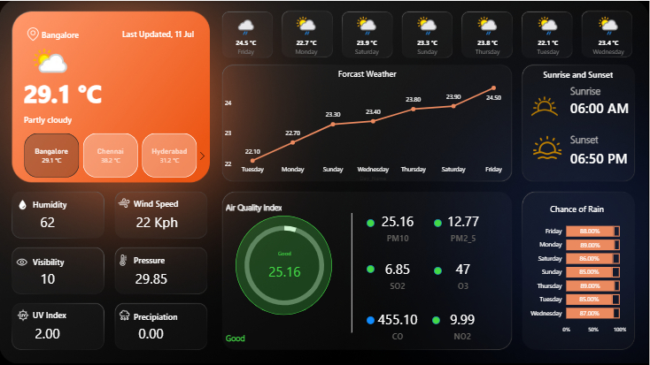

# 🌤️ Weather Monitoring Dashboard - Power BI Project

## 📌 Project Overview
This project is a real-time **Weather Monitoring Dashboard** built using a Weather API and **Power BI**. It visualizes environmental and atmospheric conditions across multiple cities interactively.

## ✅ Features
- Current Weather Data: Temperature, Humidity, Wind Speed
- 7-Day Forecast with Temperature Trend
- Real-time Air Quality Index (AQI): PM2.5, PM10, CO, NO2, O3, SO2
- Sunrise & Sunset Timings
- Rain Prediction, UV Index, Pressure, and Visibility

## 🔧 Tools & Technologies
- **Power BI**
- **Weather API**
- **JSON Parsing and Transformation**
- **DAX**
- **Data Modeling**

## 📸 Screenshot


## 🧠 Learning Outcomes
- How to integrate APIs with Power BI
- Parsing JSON to structured formats
- Building clean, modern dashboards for real-time analytics
- Data storytelling with visuals and metrics

## 🗂️ Folder Structure
```

📁 Weather\_Dashboard\_Project
├── Weather\_Dashboard.pbix
├── Weather\_Dashboard.png
└── README.md
